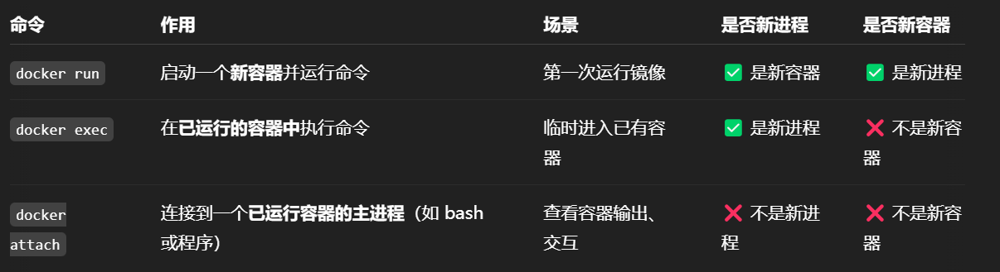

# CSAPP
环境 WSL20.04，使用vscode的WSL插件连接\
root密码参见D:\2024\CSAPP\notes0.md\
环境配置参考 https://zhuanlan.zhihu.com/p/505497911 的第一种方式\
第二种为docker配置，启动命令的docker原生进程..\

## TODO
paste-image extension 拼尽全力未能战胜，就手动复制图片吧 以后再调
## Datalab
### knowledge

### Requirements
Simulate higher-level operators with a limited number of bit operators.\
for integer puzzles, only **straightline** code is allowed; for floating-point(4 bytes, same as unsigned int) puzzles, control structures are allowed, but float data types & structs are not allowed.

| allowed operators | description           |
| ----------------- | --------------------- |
| !                 | 取反布尔值            |
| ~                 | 按位取反              |
| &                 | 按位与                |
| ^                 | 按位异或              |
| \|                | 按位或                |
| +                 | 普通加                |
| <<                | 左移低位补0           |
| >>                | 右移高位根据符号补0/1 |

### Puzzles
puzzle1 文档的描述好像写错了，写成了x || y
