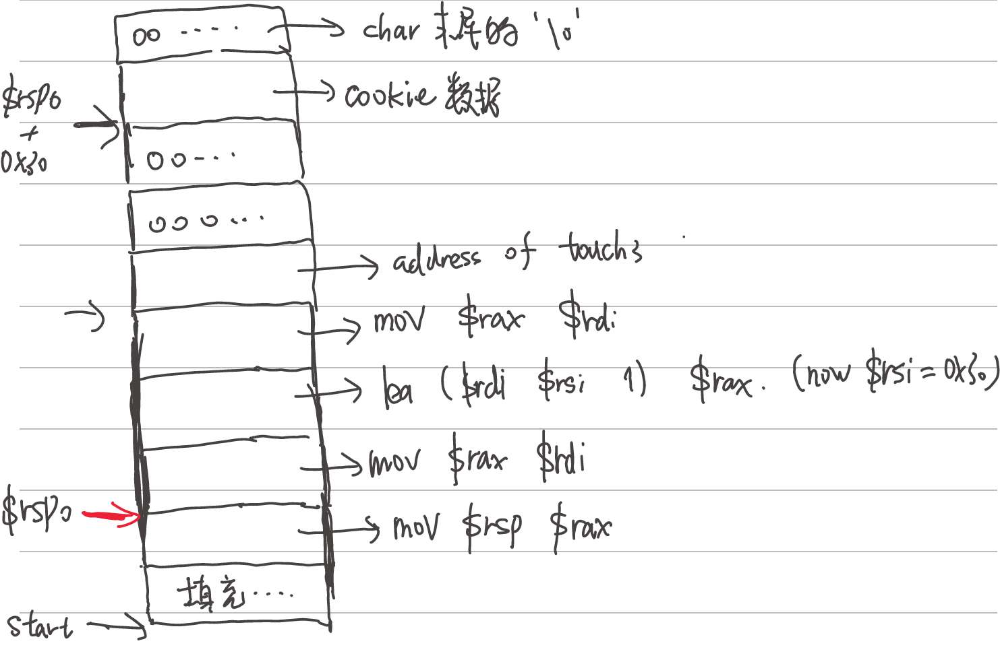

# CSAPP
环境 WSL20.04，使用vscode的WSL插件连接\
root密码参见D:\2024\CSAPP\notes0.md\
环境配置参考 https://zhuanlan.zhihu.com/p/505497911 的第一种方式\
第二种为docker配置，启动命令的docker原生进程..\


注意，如果git提交时使用的邮箱与github不一致，此提交的内容可以被同步，但不会被用户界面的contribution包含
目前WSL 全局为google邮箱（与github统一），linux kernel programming仓库下局部配置为rwth邮箱

## TODO
paste-image extension 拼尽全力未能战胜，就手动复制图片吧 以后再调
## Datalab
### Requirements
Simulate higher-level operators with a limited number of bit operators.\
for integer puzzles, only **straightline** code is allowed; for floating-point(4 bytes, same as unsigned int) puzzles, control structures are allowed, but float data types & structs are not allowed.

| allowed operators | description           |
| ----------------- | --------------------- |
| !                 | 取反布尔值            |
| ~                 | 按位取反              |
| &                 | 按位与                |
| ^                 | 按位异或              |
| \|                | 按位或                |
| +                 | 普通加                |
| <<                | 左移低位补0           |
| >>                | 右移高位根据符号补0/1 |

### Puzzles
puzzle1 文档的描述好像写错了，写成了x || y
除了howmanybits puzzle，均满足max op要求
所有puzzles思路均通过注释写在代码中
以下为howmanybits puzzle的优化版本，参考https://zhuanlan.zhihu.com/p/339047608
事实上是，在max ops=90的要求下，不可能通过我这种最暴力的线性情况得到结果（因为相当于有32/31种case，90个操作符平均下来每个case只有两个，几乎什么都做不到）
通过指数求解是自然的想法
由于结果是1~32（相当于0~31）之间的一个数，也就是说我们只需要决定一个二进制数000...00xxxxx,最后这五位的0或1
b0~b16这五个变量分别对应这五个比特的值（实际是这五个比特乘上2^n权重后对应的值）

```
int howManyBits(int x) {
    int b16,b8,b4,b2,b1,b0;
    int flag=x>>31;
    x=(flag&~x)|(~flag&x); //x为非正数则不变 ,x 为负数 则相当于按位取反
    b16=!!(x>>16) <<4; //如果高16位不为0,则我们让b16=16
    x>>=b16; //如果高16位不为0 则我们右移动16位 来看高16位的情况
    //下面过程基本类似
    b8=!!(x>>8)<<3;
    x >>= b8;
    b4 = !!(x >> 4) << 2;
    x >>= b4;
    b2 = !!(x >> 2) << 1;
    x >>= b2;
    b1 = !!(x >> 1);
    x >>= b1;
    b0 = x;
  return b0+b1+b2+b4+b8+b16+1;
}
```

## Bomblab
### Requirements
获得二进制可执行文件bomb在若干阶段所期望的输入，正确输入所有字符串即可拆弹。
在线上bomb中，每一次拆弹失败都会给服务器发送消息导致总成绩的减少，离线bomb并没有这一限制，但还是需要通过打断点等方式（如在每一个phase之前断点，在判断炸弹爆炸的指令前查看条件是否满足，如果满足立刻quit）尽可能避免爆炸的后果。

使用的汇编文件同样是ATT格式，可以在objdump时设置参数指定风格，也可以指定gdb的preferred style，有一个区别在于这里的ATT格式基本没有表示数据长度的指令后缀（因为很多可以进行推测）。

使用psol.txt时，文件需要以EOF结尾。且最后一行也需要额外打印出回车（**我不知道具体的机制是什么TODO，但所有的文本文件都应如此处理**）

phase1，单纯地比较字符串相等。

phase2，主要考验对过程传参和栈帧状态转换的理解，查看phase_2的汇编可知，它是读出六个连续的int数据，需要它们之间从1开始逐个乘2才能保证炸弹不爆炸。
这里调用的read_six_numbers函数，其中调用了sscanf函数，这个sscanf共有8个参数，在这三个函数的调用过程中，$rdi一直没有变，也就是一开始的input（所以在调用sscanf时并没有重新要求读入字符串）；第二个参数是存储在内存中的常量字符串"%d %d %d %d %d %d"，表示format；剩余六个参数分别对应到上面的phase_2栈帧中的那六个int变量的地址以接受解析的结果（这里它是完全按顺序的，导致期望的input也是一个完美的等比数列，如果在汇编中打乱顺序，input中数字的顺序也可能被打乱）。最后，sscanf的ret值表示成功读入的结果数量。
```
sscanf(str, "%d %d %d %d %d %d", &a, &b, &c, &d, &e, &f);
```

phase3(46min)，输入两个int值，x和y，关键在于一个间接跳转。地址基址在0x402470，8\*x表示偏移量，x的值在0-7之间，所以我们要使用x/8xg 这一命令，查看从0x402470开始，以8字节为单位的8块内存，每一块内存的值代表跳转目标指令地址，会将一个值移到eax中，最后比较eax和第二个参数y是否相等
可以不只有一个答案，只要偏移量x、对应操作指令赋给eax的值和输入y匹配即可

phase4(50min)，func_4是一个有三个参数的递归函数，但我并没有看出来它计算有什么实际意义，但实际也没有用到什么实际意义。读入两个int参数A和B，B必须是0，且要求func_4(A, 0, 14)的返回值必须是0，令A=7，可以让这个函数不走进入递归直接返回0

phase5(36min)，读入一个长度为6的字符串，将这个字符串的每一个char的第4位作为偏移量，从一个地址开始偏移取出char，偏移六次的结果组成一个新的字符串，必须等于一个指定的字符串，答案不唯一

phase6
这个task中，预定义了一个长度为6的链表（储存long数据），输入是六个数，范围是1~6且两两不等，代表对链表元素的index进行重排，需要满足重排后的链表是有序的（但这里对有序的比较仅仅比较低8位，相当于强转为int比较）。程序主要分为三部分：
1. 输入读取与初步校验（范围是1~6且两两不等）
2. 将node**的地址**有序地存放在\$rsp+0x20到\$rsp+0x50这段空间（6个8字节长度的long），因为链表的寻址是一个反复迭代解引用的过程，所以这里部分的代码比较难懂
3. 用刚刚写入的排序后的值重新构建成链表（也有一点难懂，见line580-line586）
5. 检验链表是否有序


0x6032d0即为预定义链表的位置，实际上这里查看内存时内存后面的‘<node1>’已经明示了这是node struct类型，一个node struct占16个字节，低8字节代表一个long类型的number，高八字节代表next pointer，即以node1为例它的next指针0x00000000006032e0指向的正是node2的地址，更确切的说是node2中number（0x00000002-000000a8）的地址，即0x6032d0+0x10（一个node struct的长度）
```
(gdb) x/14xg 0x6032d0
0x6032d0 <node1>:       0x00000001-0000014c      0x00000000006032e0
0x6032e0 <node2>:       0x00000002-000000a8      0x00000000006032f0
0x6032f0 <node3>:       0x00000003-0000039c      0x0000000000603300
0x603300 <node4>:       0x00000004-000002b3      0x0000000000603310
0x603310 <node5>:       0x00000005-000001dd      0x0000000000603320
0x603320 <node6>:       0x00000006-000001bb      0x0000000000000000
0x603330:       0x0000000000000000      0x0000000000000000
```

如下是line580-line586重新构建链表的代码，原本node struct数据的数据位置不变，变的只有其中的next字段（此外，为了保证链表的第一个元素在正确的位置，$rsp+0x20处的指针要指向链表的第三个元素而不是链表开头）
rax记录栈中\$rsp+0x20到\$rsp+0x50这六个指针的index，rdx存储‘next’，rcx存储‘current’，即：将next的地址写入current的next字段，然后将next赋给current后递增next
```
  	4011bd:	48 8b 10             	mov    (%rax),%rdx
  	4011c0:	48 89 51 08          	mov    %rdx,0x8(%rcx)
  	4011c4:	48 83 c0 08          	add    $0x8,%rax
  	4011c8:	48 39 f0             	cmp    %rsi,%rax
  	4011cb:	74 05                	je     4011d2 <phase_6+0xde>
  	4011cd:	48 89 d1             	mov    %rdx,%rcx
  	4011d0:	eb eb                	jmp    4011bd <phase_6+0xc9>
```

phase7
根据bomb.c的注释和汇编代码，可以得知有一个隐藏炸弹，skip

## Attacklab
### Requirements
对两个有漏洞的程序进行五个攻击。
对应教材：章节3.10.3，3.10.4。
ctarget: An executable program vulnerable to code-injection attacks
rtarget: An executable program vulnerable to return-oriented-programming attacks
对攻击的范围有一定限制：如果随便输入字符串，大概率覆盖返回地址的是一个没有被分配给当前程序的内存地址，访问时程序会因为段错误终止，而不是执行攻击者期待的行为；但即使返回到有效的地址，这个地址也有一定限制，如只能影响程序代码不能影响测试代码
在任何位置都不能出现‘\n’对应的ASCII码，会导致getbuf停止读入。
cookie的作用是为每个人生成不一样的target文件，在请求targetk.tar文件时，将个人电脑与k这个序号关联起来，以执行正确的测试。但由于当前是离线作业，这个功能是不能用的，直接运行会报错在illegal host。所以要加-q这一参数，即不启用服务器，仅在本地运行。
### Part1 code injection attacks

```
gdb ./ctarget
Cookie: 0x59b997fa
//本lab使用的cookie
gcc -c inject_code3.s
//将汇编语言转机器码
objdump -d inject_code3.o > inject_code3.d
//将机器码反汇编（得到每一条命令对应的机器码）
./hex2raw < exploit3.txt | ./ctarget -q
//测试运行
run < <(./hex2raw < exploit3.txt) -q
//从文件读取输入并将ASCII转String后直接连接gdb进入调试
```
※ 可以向地址写入32位立即数，但不能直接向地址写入64位的立即数，可以用寄存器作为过渡
※ 考虑到加法的模性质，这里的对栈指针加一个值相当于正常的sub栈指针，即向低地址增长
add    $0xffffffffffffff80,%rsp   相当于sub ...

**level1**，单纯的地址跳转，需要覆盖返回地址，但注意顺序，目标地址的字符串与它的ASCII码形式在**字节上（而不是位上）**排列顺序相反。因为输入是从左往右读，左边是低位，但实际的地址右边是低位。

**level2**，执行注入代码，需要两次人为构造的跳转，大体流程为：缓冲区溢出覆盖getbuf的返回地址，并注入代码->getbuf返回时跳转到注入代码的位置->给注入代码使用push构造返回地址（即目标函数touch）->目标代码执行->目标代码返回，跳转到touch函数。

在ret指令执行时，取出rsp位置的数据作为下一条指令的地址，并将rsp加8，这个过程是比较透明的（不会将计算写在汇编里，算是ret的语义）。对于注入的代码，并没有真正意义调用它的函数，所以要用push人为制造一个返回地址。

**level3**，大体框架与level2一致，只是多了写内存的一步。容易出现的问题就是segment fault非法访存，只要是对于已映射的空间，就没有问题。比如访问调用它的祖先函数的栈帧是完全没有问题的。\
这里不允许直接将64位立即数写入内存，需要用寄存器过渡一下；以及读取char*时，逐字节读取（也就是两个十六进制数），读到0x00才会终止，所以要写入终止符号。\
具体流程见下图所示。


### Part2 return oriented programming
由于使用了栈随机化技术（运行时栈被随机化，**但存放可执行代码的内存位置是不变的**，这也给了ROP攻击操作的空间）和约束可执行代码的区域这两种防范方法，代码注入在Part2并不可行。\
因此使用ROP（return oriented programming）这一技术进行攻击，其原理就是使用被攻击程序自己的函数片段拼凑成我们想执行的程序。而可以使用的只有ret前某一位置到ret的一小段汇编序列（更实际地说，一条指令），称为gadget\
汇编指令的机器码设计上，就是只看最前面的操作码就可以没有歧义地解释这条指令：是什么、有多长以及其他语义。所以实际上，通过截断指令，我们还能拥有更多的可选指令：
```
4019a0:	8d 87 48 89 c7 c3    	lea    -0x3c3876b8(%rdi),%eax
//对于这条汇编，如果我们让代码跳转到4019a2，即48处
//会立刻得知这是一条mov R1 R2指令，机器码为48 89 c7，即mov rax rdi
//然后c3表示ret
```
- 如果上面的‘48 89 c7’后不是c3？\
如果是90，表示nop（no operation）；或者是如图3-D中的四个指令对应的机器码（其中的前两条会操作寄存器，但这是在与自身与/或，不会改变其值；而cmp和test指令本来也不会改变寄存器的值而只会改变标识位） 都没有问题，没有任何副作用\
- 如何连续执行多条指令？\
  被攻击函数（即getbuf）的栈帧上方（高地址处）是原本的返回地址，通过栈溢出，我们用第一个gadget的起始地址替换此处的8字节；gadget不是通过正常调用到达的，是一个不完整的函数，因为只执行ret前的很少量代码，它并没有栈帧，也就是说当前rsp指向的就是它的‘返回地址’，也就是我们注入的第二个8字节位置。当第一个gadget结束，即走到ret，rsp内地址指向的指令将被执行，同时rsp被加8；以此类推...
- 如何注入数据到寄存器？\
  当gadget的指令是pop，我们可以将注入的一个数据弹出进指定的寄存器

**level1/2**\
略

**level3**\
回顾一下我们现在可以进行的操作：可以将值在寄存器间转移、可以将我们指定的值写入寄存器，可以确定这个函数最后跳转到哪里\
假定每一个gadget都只执行一条**有效的**指令（此lab中事实如此）。在lab3中我们需要写数据到内存，再将数据的位置写入寄存器；前者能做到，通过覆盖栈的内容，我们可以替换返回地址，自然也可以写入数据；对于后者，唯一将地址写入寄存器的方式是mov $rsp R，因为只有rsp内存放地址。但两者无法再一个gadget内同时实现。\
扩展的gadget farm中提供了一条完整的指令作为gadget：
```
4019d6:	48 8d 04 37          	lea    (%rdi,%rsi,1),%rax
```
借助它我们可以实现地址偏移，从而分离这两步操作，具体流程如下图所示


正常操作是向rsi中先用pop数据的方式写一个指定的偏移量，再将cookie字符串的二进制表示写入栈上方的指定内存；但我并没有pop，而是直接用了rsi中原有的值0x30（这是之前执行的函数残留的值，虽然栈是随机的，但这个值是稳定的）

**最后一个问题**\
在我做完上面的一切后，调试已经能跑通了，可以正确跳转到touch3，且此时已经能显示传入的char*代表字符串就是cookie对应的字符串，但是结果却是segment fault，原因在于hexmatch中<__sprintf_chk@plt>函数中的报错，十分神奇\
我一开始怀疑是因为我错误地覆盖了或没有保存寄存器的值，但细想显然并非如此：保存寄存器的值是为了**正确地返回被攻击函数（getbuf）的被调用者（test）**，但这里并不期望可以正确返回，只要hit到touch函数即可，保存寄存器并没有意义；栈帧也是如此，通过栈溢出，我们**覆盖了高地址的栈帧**，也就是返回函数的栈被破坏了，但这并不影响之后的内容。在hit touch3函数后，一切新调用的复杂函数都是在向低地址增长，不会对我们写入的内容有任何影响\
参考https://zhuanlan.zhihu.com/p/710856500后\
问题和我一样，原因在于linux系统**对栈指针rsp的128位对齐要求**，也就是rsp中地址结尾**只能是0不能是8**\，更确切地说，是在**call之前**必须满足**这一对齐**要求
尤其是存放touch3地址处的rsp必须满足对齐，因为其它gadget都是只执行一行指令的小函数，也不会再引用rsp的值，不对齐就算了；但hit到touch3后，要进行复杂的库函数调用。也就是说，之后的栈都是基于这一刻的rsp来增长和收缩的，这一刻不对齐会导致之后某处call之前不对齐导致段错误（因为按规范，其它部分的代码肯定是基于前面对齐的前提下保证对齐；那么前面不对齐+按这个前提做出调整，结果必然是不对齐）

